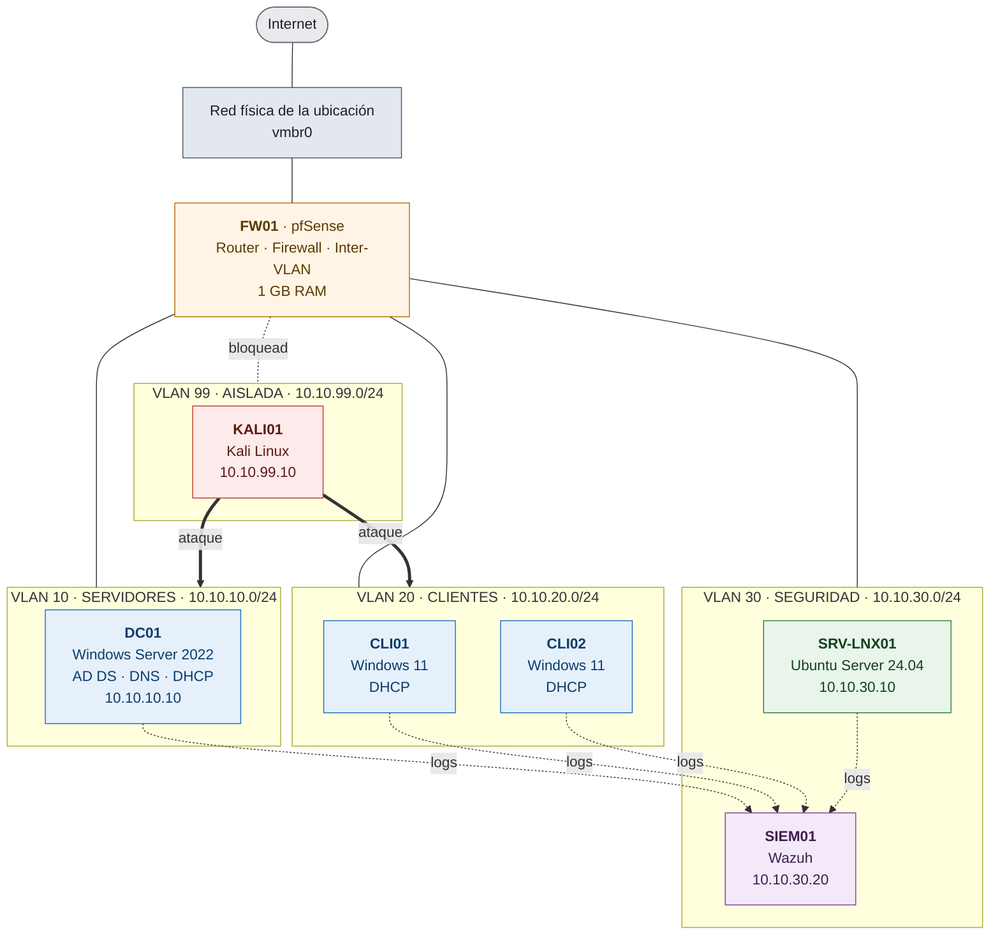

# Arquitectura del laboratorio

**Versión:** 1.0 · **Fecha:** agosto de 2026
**Estado:** diseñado, pendiente de implementación

---

## 1. Objetivo del diseño

Replicar la infraestructura de una empresa pequeña (~50 empleados) con el nivel de segmentación
que se considera buena práctica, para poder:

1. Administrarla como lo haría un sysadmin (usuarios, políticas, permisos).
2. Atacarla desde un segmento aislado, de forma controlada.
3. Detectar esos ataques desde un SIEM, como lo haría un analista de SOC.

Tres restricciones guiaron las decisiones:

- **Aislamiento del segmento ofensivo.** El tráfico de ataque nunca sale del laboratorio.
- **Segmentación realista.** Servidores, clientes y seguridad en VLANs separadas, no todo plano.
- **Reproducibilidad.** Todo documentado para poder reconstruirlo desde cero.

---

## 2. Diagrama de red

**Cómo leerlo:** las líneas sólidas son conectividad permitida. La línea punteada entre el
firewall y la VLAN 99 marca que ese segmento **no tiene salida a internet**. Las flechas
punteadas hacia SIEM01 son el envío de logs de todos los endpoints. Las flechas gruesas desde
KALI01 son las rutas de ataque habilitadas a propósito.

---

## 3. Inventario de máquinas virtuales

| VM | Sistema operativo | vCPU | RAM | Disco | VLAN | IP | Rol |
|---|---|---|---|---|---|---|---|
| `FW01` | pfSense CE | 2 | 1 GB | 16 GB | WAN + trunk | .1 en cada VLAN | Router, firewall, DHCP relay |
| `DC01` | Windows Server 2022 | 2 | 4 GB | 60 GB | 10 | 10.10.10.10 | AD DS, DNS, DHCP |
| `CLI01` | Windows 11 Pro | 2 | 4 GB | 60 GB | 20 | DHCP | Cliente de dominio |
| `CLI02` | Windows 11 Pro | 2 | 4 GB | 60 GB | 20 | DHCP | Cliente de dominio |
| `SRV-LNX01` | Ubuntu Server 24.04 | 2 | 2 GB | 40 GB | 30 | 10.10.30.10 | Servicios Linux, práctica |
| `SIEM01` | Ubuntu Server + Wazuh | 4 | 4 GB | 80 GB | 30 | 10.10.30.20 | SIEM (desde semana 12) |
| `KALI01` | Kali Linux | 2 | 4 GB | 40 GB | 99 | 10.10.99.10 | Simulación de ataques |

**RAM total si todo está encendido:** 23 GB + ~2 GB del host.

### Perfiles de encendido según la RAM disponible

No todo tiene que estar prendido a la vez. En un entorno real tampoco.

| Perfil | VMs encendidas | RAM | Para qué |
|---|---|---|---|
| **Mínimo** (8 GB) | FW01 + DC01 + SRV-LNX01 | 7 GB | Semanas 6–7: AD y Linux |
| **Trabajo** (16 GB) | + CLI01 | 11 GB | Semanas 6–11: administración con cliente |
| **Blue team** (16 GB) | FW01 + DC01 + CLI01 + SIEM01 | 13 GB | Semanas 12–15: detección |
| **Completo** (32 GB) | Todas | 23 GB | Semanas 14–17: ataque y detección en vivo |

---

## 4. Plan de direccionamiento

| VLAN | Nombre | Red | Gateway | Rango DHCP | Reservado |
|---|---|---|---|---|---|
| — | WAN | DHCP de la red física | — | — | — |
| 10 | SERVIDORES | 10.10.10.0/24 | 10.10.10.1 | — (estático) | .10–.49 servidores |
| 20 | CLIENTES | 10.10.20.0/24 | 10.10.20.1 | .100–.200 | .10–.49 impresoras |
| 30 | SEGURIDAD | 10.10.30.0/24 | 10.10.30.1 | — (estático) | .10–.49 herramientas |
| 99 | AISLADA | 10.10.99.0/24 | 10.10.99.1 | .100–.150 | .10 atacante |

**Dominio Active Directory:** `lab.interno`

> **Por qué `lab.interno` y no `lab.local`:** `.local` está reservado para mDNS/Bonjour, el
> protocolo que usa macOS y que también implementa Avahi en Linux. Usarlo en un dominio de AD
> genera conflictos de resolución difíciles de diagnosticar. Es un error clásico de laboratorio.

**Servidor DNS de todas las VLANs internas:** `10.10.10.10` (DC01).
En un dominio de AD, el DNS **debe** ser el controlador de dominio. Apuntar los clientes al DNS
del router es la causa número uno de que la unión al dominio falle.

---

## 5. Reglas de firewall

Filosofía: **denegar por defecto**, permitir explícitamente. Cada regla existe por una razón.

| # | Origen | Destino | Servicio | Acción | Por qué |
|---|---|---|---|---|---|
| 1 | VLAN 99 | WAN / Internet | cualquiera | **BLOQUEAR** | El tráfico de ataque no sale del lab. Innegociable |
| 2 | VLAN 99 | VLAN 30 | cualquiera | **BLOQUEAR** | El atacante no debe poder tocar el SIEM |
| 3 | VLAN 99 | VLAN 10, 20 | cualquiera | PERMITIR | Rutas de ataque habilitadas a propósito |
| 4 | VLAN 20 | VLAN 10 | AD, DNS, SMB, Kerberos | PERMITIR | Clientes al controlador de dominio |
| 5 | VLAN 10, 20, 30 | VLAN 30 | 1514, 1515 TCP | PERMITIR | Envío de logs al SIEM |
| 6 | VLAN 10, 20, 30 | WAN | HTTP, HTTPS, DNS | PERMITIR | Actualizaciones |
| 7 | VLAN 10, 20 | VLAN 99 | cualquiera | BLOQUEAR | Nadie entra al segmento aislado |
| 8 | cualquiera | cualquiera | cualquiera | BLOQUEAR + log | Regla final. Todo lo no permitido se registra |

> **La regla 1 es la más importante del laboratorio.** Un escaneo que se escapa a internet
> genera un reporte de abuso contra la conexión desde donde salió. Si el lab alguna vez se
> muda a un servidor alquilado, esta regla es la diferencia entre estudiar tranquilo y que te
> den de baja la cuenta.

---

## 6. Decisiones de diseño

| Decisión | Alternativa descartada | Por qué |
|---|---|---|
| pfSense como router | Routing nativo de Proxmox | Se aprende un firewall real, con reglas, NAT y logs. Es lo que hay en las empresas |
| 4 VLANs | Red plana | La segmentación es lo que evalúan en entrevista. Una red plana no enseña nada |
| Kali en VLAN sin salida | Kali en la misma red | Contención. Además fuerza a pensar el firewall como control, no como obstáculo |
| Wazuh como SIEM principal | Splunk únicamente | Wazuh es gratis, open source y corre en ARM. Splunk se suma después, en paralelo |
| DNS en el DC | DNS en pfSense | Es el requisito de AD. Hacerlo mal es el error más común al montar un dominio |
| Ubuntu Server LTS | Ubuntu Desktop | Sin entorno gráfico: menos RAM y obliga a trabajar por línea de comandos |

---

## 7. Orden de construcción

Cada paso depende del anterior. Saltearse el orden genera problemas difíciles de diagnosticar.

1. **Proxmox** — instalación, red del host, `vmbr1` interno
2. **FW01 (pfSense)** — WAN, LAN, VLANs, reglas base
3. **DC01** — Windows Server, promoción a Domain Controller, DNS
4. **DHCP** — en DC01 para la VLAN 20
5. **CLI01** — Windows 11, unión al dominio ← *primer hito verificable*
6. **SRV-LNX01** — Ubuntu, SSH, servicios
7. **GPOs** — políticas de contraseña, restricciones, mapeo de unidades
8. **CLI02** — segundo cliente, para probar movimiento lateral
9. **SIEM01** — Wazuh, agentes en todos los endpoints *(semana 12)*
10. **KALI01** — última, cuando ya hay algo que atacar y algo que detecte *(semana 14)*

> **Snapshot después de cada paso.** Es la ventaja de virtualizar: romper sin miedo y volver
> atrás en segundos. Un laboratorio sin snapshots se usa con miedo, y con miedo no se aprende.

---

## 8. Pendiente

- [ ] Instalar Proxmox y configurar `vmbr1`
- [ ] Desplegar FW01 y validar el ruteo entre VLANs
- [ ] Promover DC01 y verificar la resolución DNS interna
- [ ] Unir CLI01 al dominio `lab.interno`
- [ ] Documentar cada paso con capturas en las carpetas correspondientes
