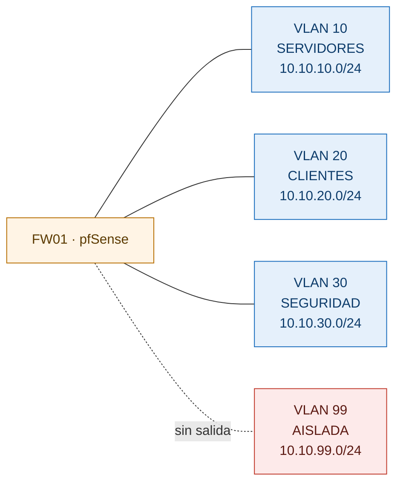

# homelab

Laboratorio de infraestructura y seguridad construido desde cero para practicar administración de
sistemas y detección de amenazas en un entorno que replica el de una empresa pequeña.

**Estado:** en construcción · **Inicio:** agosto de 2026

---

## Qué hay acá

Un entorno virtualizado sobre **Proxmox VE** con segmentación de red real: firewall pfSense,
dominio de Active Directory, clientes Windows, servidor Linux, SIEM y un segmento ofensivo
aislado. Cada componente está documentado con las decisiones de diseño detrás, no solo con los
pasos de instalación.

El diagrama completo, el inventario de VMs, el plan de direccionamiento y las reglas de firewall
están en [`00-diseno/arquitectura.md`](00-diseno/arquitectura.md).

---

## Estructura del repositorio

| Carpeta | Contenido |
|---|---|
| [`00-diseno/`](00-diseno/) | Arquitectura del lab, diagramas y decisiones de diseño |
| [`01-redes/`](01-redes/) | Topologías de Packet Tracer, subnetting y análisis de tráfico |
| [`02-linux/`](02-linux/) | Administración de Linux, hardening y scripting de sistema |
| [`03-windows-ad/`](03-windows-ad/) | Windows Server, Active Directory y políticas de grupo |
| [`04-scripting/`](04-scripting/) | Automatización en Bash, PowerShell y Python |
| [`05-blue-team/`](05-blue-team/) | SIEM, detecciones, análisis de incidentes y forense |
| [`bitacora/`](bitacora/) | Una entrada por semana. Qué se hizo, qué se rompió, qué se aprendió |

---

## Stack

**Virtualización:** Proxmox VE
**Red:** pfSense CE · VLANs 802.1Q
**Windows:** Windows Server 2022 (AD DS, DNS, DHCP) · Windows 11 Pro
**Linux:** Ubuntu Server 24.04 LTS
**Seguridad:** Wazuh · Sysmon · Suricata · Kali Linux
**Herramientas:** Wireshark · Packet Tracer · Nmap

---

## Cómo leer este repo

Cada carpeta tiene su propio `README.md` con el índice de lo que contiene. Los documentos siguen
siempre la misma estructura: **qué problema resuelve**, **cómo lo abordé**, **qué aprendí**.

Si venís de una oferta de trabajo y tenés poco tiempo, mirá
[`00-diseno/arquitectura.md`](00-diseno/arquitectura.md) y la entrada más reciente de
[`bitacora/`](bitacora/).
