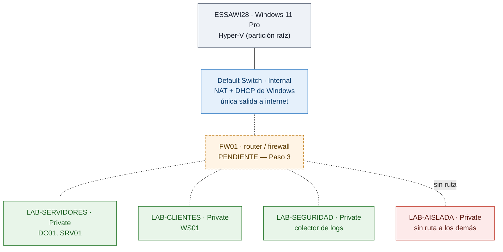

# homelab

Laboratorio de infraestructura y seguridad montado sobre **Hyper-V**, construido a mano y
documentado paso a paso para practicar administración de sistemas Windows/Linux y detección de
amenazas en un entorno que imita al de una empresa chica.

**Autor:** Joaquín Lagoria — estudiante de Seguridad Informática, trabajando en infraestructura IT.
**Objetivo del proyecto:** llegar a un puesto de **Analista SOC L1 / Service Desk** con evidencia
verificable en vez de una lista de cursos.

> **Estado: en construcción.** Arrancó el 31/08/2026 y se levanta de cero, en público.
> Este README dice en cada punto **qué está hecho y qué todavía no**. Nada de lo que figura acá
> como terminado está inventado.

---

## En 40 segundos

| | |
|---|---|
| **Qué es** | Un entorno virtualizado con segmentación de red, dominio de Active Directory, cliente Windows, servidor Linux y envío de telemetría a un SIEM. |
| **Dónde corre** | Hyper-V sobre `ESSAWI28`, una PC de escritorio con Windows 11 Pro (Ryzen 7 8700G, 16 GB), administrada en remoto por SSH sobre Tailscale. |
| **Qué demuestra** | Diseño de red segmentada, administración de AD y GPOs, hardening, scripting (Bash/PowerShell/Python) y detección de ataques con reglas propias. |
| **Cómo se sigue** | Un plan de 75 pasos en 10 bloques. Cada paso termina con un archivo en este repositorio: si no está escrito, no está hecho. |
| **Por dónde empezar a leer** | [`00-diseno/arquitectura.md`](00-diseno/arquitectura.md) y la entrada más reciente de [`bitacora/`](bitacora/). |

---

## Estado real del laboratorio

Verificado sobre la máquina el **31/08/2026**.

| Pieza | Estado |
|---|---|
| Hipervisor Hyper-V habilitado y corriendo | ✅ Hecho |
| Cuatro switches virtuales privados creados | ✅ Hecho |
| Acceso remoto: SSH sobre Tailscale (RDP como respaldo) | ✅ Hecho |
| Estructura de carpetas del host (`C:\Lab\{VMs,Discos,ISOs}`) | ✅ Hecho |
| Repositorio y documentación de diseño | 🔨 En curso |
| `FW01` — router/firewall del lab | ⏳ Pendiente · decisión de stack abierta |
| `DC01` — Windows Server 2022, AD DS, DNS, DHCP | ⏳ Pendiente |
| `WS01` — cliente Windows 11 unido al dominio | ⏳ Pendiente |
| `SRV01` — servidor Linux | ⏳ Pendiente |
| Telemetría hacia Microsoft Sentinel + consultas KQL | ⏳ Pendiente |

**VMs del laboratorio hoy: cero.** El primer paso del plan es entender virtualización antes de
crear nada — precisamente porque la configuración inicial del host se hizo demasiado rápido y sin
entenderla del todo. Rehacerla entendiéndola es el motivo por el que existe este laboratorio.

---

## Topología

Estado actual: cuatro switches **privados**, que por definición no se comunican entre sí ni con el
host. Falta la pieza que los une.

Las líneas punteadas son lo que **todavía no existe**. El plan de direccionamiento y el diseño
completo están en [`00-diseno/arquitectura.md`](00-diseno/arquitectura.md).

---

## Estructura del repositorio

Las carpetas numeradas siguen los bloques del plan de estudio. Cada una tiene su propio `README.md`
con el índice de lo que va adentro y a qué pasos corresponde.

| Carpeta | Contenido | Bloques · pasos |
|---|---|---|
| [`00-diseno/`](00-diseno/) | Arquitectura, conceptos de virtualización, topología y guía de reproducción | Bloque 0 · 1–3, 10 |
| [`01-redes/`](01-redes/) | TCP/IP, subnetting, VLANs, Packet Tracer y análisis con Wireshark | Bloque 1 · 11–17 |
| [`02-linux/`](02-linux/) | Administración de Linux, análisis de logs y hardening de servidor | Bloque 2 · 18–24 |
| [`03-windows-ad/`](03-windows-ad/) | Windows Server, Active Directory, GPOs, Event IDs y Sysmon | Bloques 0 y 3 · 4–8, 25–30 |
| [`04-scripting/`](04-scripting/) | Automatización en Bash, PowerShell y Python | Bloque 4 · 31–37 |
| [`05-blue-team/`](05-blue-team/) | SIEM, KQL, MITRE ATT&CK, detecciones, respuesta a incidentes y forense | Bloque 7 · 50–63 |
| [`06-cloud-datos/`](06-cloud-datos/) | SQL, Docker, Azure, Terraform, Ansible, pandas y observabilidad | Bloques 5 y 8 · 38–44, 64–68 |
| [`lab/`](lab/) | Configuración de la infraestructura: reglas de firewall, Sysmon, IaC, datos de ejemplo | Transversal |
| [`bitacora/`](bitacora/) | Registro fechado: qué se hizo, qué se rompió, cómo se resolvió, qué se aprendió | Transversal |

**Convención de nombres:** los documentos llevan adelante el número del paso que los produce —
`00-diseno/01-conceptos-virtualizacion.md` es el resultado del Paso 1. Así se puede ir del plan al
archivo y del archivo al plan sin buscar.

---

## Stack

| Capa | Herramienta | Estado |
|---|---|---|
| Virtualización | Hyper-V (Windows 11 Pro) | En uso |
| Router / firewall | Debian 12 + `nftables` *(candidato)* · pfSense como alternativa | Sin decidir — Paso 3 |
| Directorio | Windows Server 2022 — AD DS, DNS, DHCP, GPO | Pendiente |
| Cliente | Windows 11 Pro unido al dominio | Pendiente |
| Servidor Linux | Debian / Ubuntu Server | Pendiente |
| Telemetría de endpoint | Sysmon | Pendiente |
| SIEM | Microsoft Sentinel + KQL | Pendiente |
| Detecciones | Reglas Sigma mapeadas a MITRE ATT&CK | Pendiente |
| Análisis de red | Wireshark · Cisco Packet Tracer | En uso |
| Automatización | Bash · PowerShell · Python | En uso |
| Acceso remoto | Tailscale + OpenSSH | En uso |

---

## Cómo leer este repositorio

Cada documento responde siempre las mismas tres preguntas: **qué problema resuelve**, **cómo lo
abordé** y **qué aprendí**. Los errores están documentados a propósito: un laboratorio que salió
bien a la primera no enseñó nada.

Si venís de una búsqueda laboral y tenés cinco minutos:

1. [`00-diseno/arquitectura.md`](00-diseno/arquitectura.md) — el diseño y las decisiones, con su justificación.
2. La entrada más reciente de [`bitacora/`](bitacora/) — en qué anda el proyecto esta semana.
3. [`05-blue-team/`](05-blue-team/) — el trabajo de detección, que es el objetivo final de todo esto.
